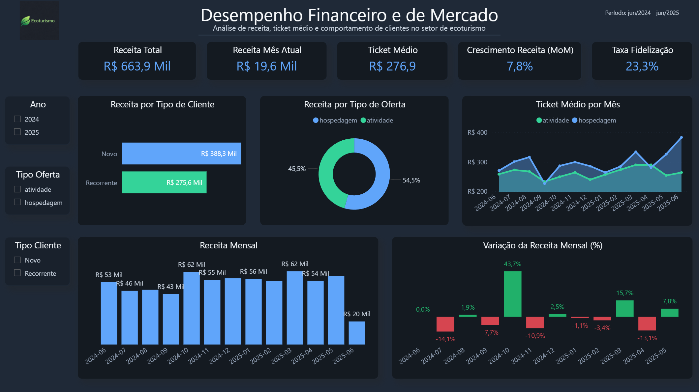
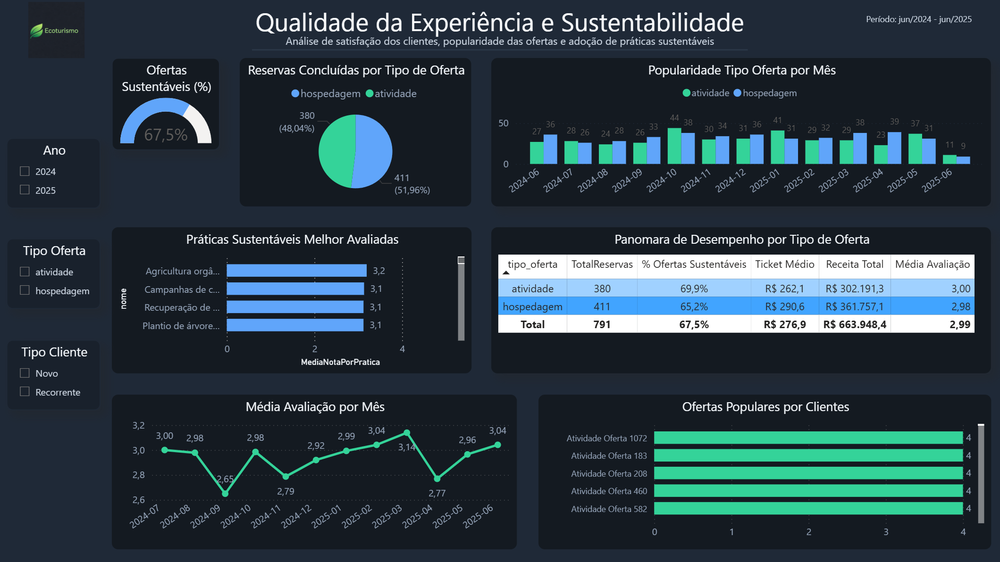

# 📊 Análise de Dados no Setor de Ecoturismo

Este projeto apresenta uma análise de dados focada no **desempenho financeiro, comportamento de clientes e sustentabilidade de ofertas no setor de ecoturismo**.

A análise foi desenvolvida utilizando **SQL para exploração e tratamento de dados** e **Power BI para construção de dashboards interativos**, permitindo identificar padrões de receita, comportamento de clientes e adoção de práticas sustentáveis.

---

## 🎯 Objetivos da análise

- Analisar a **evolução da receita ao longo do tempo**
- Identificar diferenças de comportamento entre **clientes novos e recorrentes**
- Avaliar **ticket médio e taxa de fidelização**
- Entender a **popularidade das ofertas**
- Investigar o nível de **adoção de práticas sustentáveis**

---

## 🛠️ Ferramentas utilizadas

- **SQL (BigQuery)** — exploração e consultas analíticas  
- **Power BI** — visualização de dados e construção de dashboards  
- **GitHub** — organização e documentação do projeto  

---

## 📊 Dashboards

O projeto contém dois dashboards principais:

### 1️⃣ Desempenho Financeiro e Mercado

Analisa métricas relacionadas à receita e comportamento de clientes.

**Principais indicadores:**

- Receita total  
- Crescimento mensal  
- Ticket médio  
- Taxa de fidelização  
- Receita por tipo de oferta  
- Receita por tipo de cliente  

  
   
  <em>Dashboard 1: Análise de desempenho financeiro, evolução da receita e comportamento de clientes.</em>

---

### 2️⃣ Qualidade da Experiência e Sustentabilidade

Explora a relação entre experiência dos clientes e práticas sustentáveis.

**Principais indicadores:**

- Avaliação média das ofertas  
- Popularidade por tipo de oferta  
- Adoção de práticas sustentáveis  
- Desempenho por categoria de oferta  

  
   
  <em>Dashboard 2: Análise da experiência dos clientes, popularidade das ofertas e práticas sustentáveis.</em>

---

## 🔎 Principais insights da análise

- A plataforma gerou aproximadamente **R$ 663 mil em receita**, com **ticket médio de R$ 276 por reserva**.  
- **Hospedagens concentram a maior parte da receita**, além de apresentar ticket médio superior às atividades.  
- A **taxa de fidelização é de 23,3%**, indicando potencial para estratégias de retenção.  
- **67,5% das ofertas adotam práticas sustentáveis**, reforçando o alinhamento com o conceito de **ecoturismo**.
